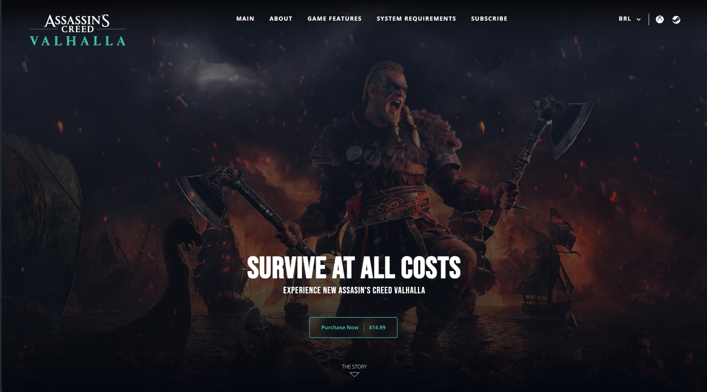

# Assassin's Creed Page

## 📖 Descrição:
Este projeto é uma página inspirada na famosa franquia **Assassin's Creed**, desenvolvida com o objetivo de praticar minhas habilidades com **TailwindCSS**. O foco foi em melhorar a estilização e a responsividade utilizando essa poderosa ferramenta de CSS. Além disso, o projeto também incorpora **React** para melhorar a estrutura e interatividade.

## 📸 Prévia do Projeto:

  

## 🚀 Tecnologias Utilizadas:
- ✅ **TailwindCSS** – Estilização rápida e eficiente.
- ✅ **React** – Framework para criar interfaces de usuário dinâmicas.
  
## ⚡ Como Rodar o Projeto:

1. Clone este repositório
2. Entre no diretório
3. Caso ja tenha o node.js instalado basta digitar no prompt: 
   . npm install 
   . npm start